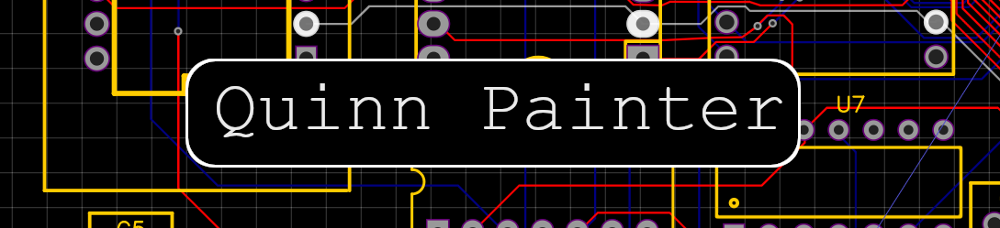

   
   
  
  
  

-------
Hi, I'm Quinn!  
I mainly do low level / embedded development, messing with the likes of game system emulators and Game Boy homebrew.  
Recently been doing C, C++, Assembly (6502, SM83, ARM) and Rust, but have used many more things. My other interests include 3D printing, game development, and writing little Python scripts to solve random little problems.

That banner is pretty neat, huh? It's made from the schematic for my [6502Computer](https://github.com/QuinnPainter/6502Computer) project.

<!--
## 🔧 Skills

-->

## Some fun stats

<!--
**QuinnPainter/QuinnPainter** is a ✨ _special_ ✨ repository because its `README.md` (this file) appears on your GitHub profile.

Here are some ideas to get you started:

- 🔭 I’m currently working on ...
- 🌱 I’m currently learning ...
- 👯 I’m looking to collaborate on ...
- 🤔 I’m looking for help with ...
- 💬 Ask me about ...
- 📫 How to reach me: ...
- 😄 Pronouns: ...
- ⚡ Fun fact: ...
-->
